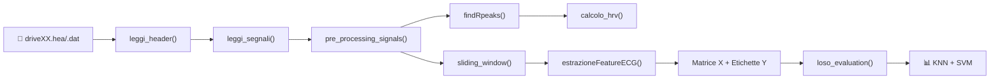

# DriverML
## 1. Paper di riferimento
- ***DriverML*** contiene le *specifiche generali* per lo sviluppo del modello;
- ***Automatic stress detection in car drivers*** contiene le *specifiche di riferimento numerico* al quale i nostri valori devono avvicinarsi dopo la classificazione. 

Per le ***feature aggiuntive*** al paper DriverML, ci basiamo sulle *feature che vengono calcolate nel secondo paper*.

## 2. Panoramica del modello

DriverML è un sistema di classificazione binaria (stress / no stress) dello stato di un guidatore, basato sull'analisi del segnale ECG estratto dal dataset PhysioNet [Stress Recognition in Automobile Drivers](https://physionet.org/content/drivedb/1.0.0/).

### Architettura della Pipeline

### File e Responsabilità

| File | Ruolo |
|------|-------|
| `run_driverml.m` | Script principale (orchestratore) |
| `leggi_header.m` | Parsing del file `.hea` (metadati del record) |
| `leggi_segnali.m` | Lettura binaria del file `.dat` e conversione in unità fisiche |
| `pre_processing_signals.m` | Filtraggio ECG (Butterworth passa-banda 0.5–40 Hz) |
| `findRpeaks.m` | Rilevamento picchi R con validazione geometrica QRS |
| `calcolo_hrv.m` | Calcolo intervalli RR con filtraggio fisiologico |
| `sliding_window.m` | Partizionamento in finestre (60s, passo 60s) |
| `estrazioneFeatureECG.m` | Estrazione di 20 feature per finestra |
| `hurst.m` | Calcolo dell'esponente di Hurst (R/S analysis) |
| `loso_evaluation.m` | Validazione Leave-One-Subject-Out con KNN e SVM |
